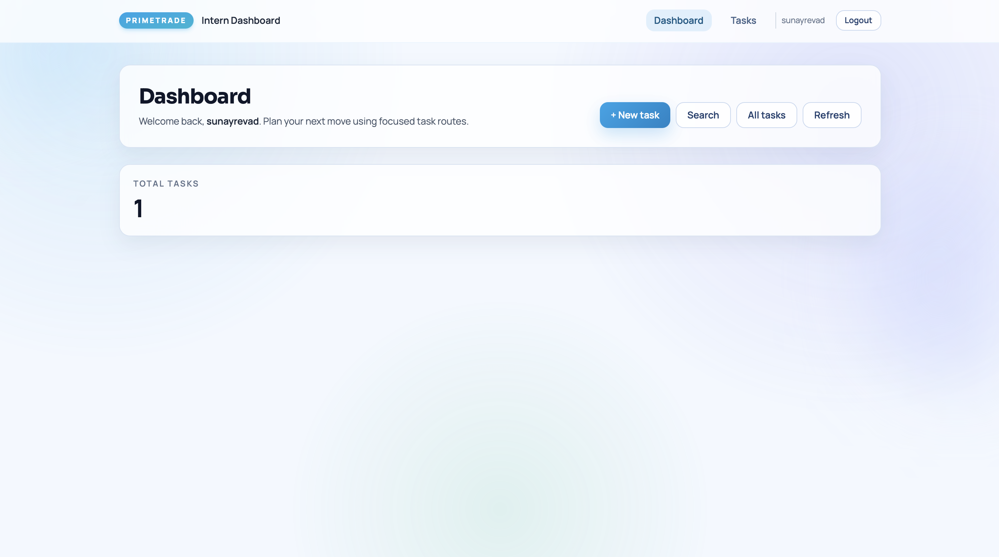
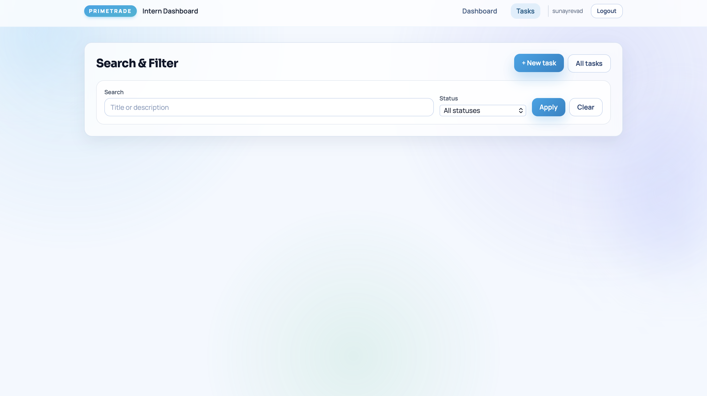

# PrimeTrade Frontend Intern Task

This repository contains a complete solution for the **Frontend Developer Intern** assignment:

- **Frontend**: React + Vite + TailwindCSS
- **Backend**: Node.js + Express + PostgreSQL (Prisma ORM + Prisma Accelerate)
- **Auth**: JWT-based login / signup with protected routes
- **Dashboard**: Profile information and task management with search, filter, and CRUD

---

## Project structure

- `frontend/` – React SPA (Vite) with TailwindCSS
- `backend/` – Express REST API connected to PostgreSQL
- `postman_collection.json` – Ready-to-import Postman collection for all APIs

---

## Dashboard Screenshot



## Search & Filter Screenshot



## All Tasks Screenshot


## Create Task Screenshot


## Getting started

### 1) Prerequisites

- Node.js LTS (>= 18)
- PostgreSQL database (Aiven/Neon/Supabase/local)

### 2) Backend setup (`backend/`)

```bash
cd backend
cp .env.example .env
# edit .env if needed (database URLs, JWT secret, client origin, etc.)

npm install
npm run prisma:generate
npm run prisma:push
npm run dev
```

Key environment variables (see `.env.example`):

- `PORT` – API port (default `4000`)
- `DATABASE_URL` – Prisma Accelerate URL (`prisma+postgres://...`)
- `DIRECT_URL` – Direct PostgreSQL connection string (`postgres://...`)
- `JWT_SECRET` – long random string used to sign JWTs
- `JWT_EXPIRES_IN` – token TTL (e.g. `7d`)
- `CLIENT_ORIGIN` – frontend origin (default `http://localhost:5173`)

The API exposes:

- `POST /api/auth/register` – create account (hashes password with `bcrypt`)
- `POST /api/auth/login` – login and receive JWT
- `GET /api/users/me` – fetch current user profile
- `PUT /api/users/me` – update profile (e.g. name)
- `GET /api/tasks` – list tasks (supports `search` + `status` filters)
- `POST /api/tasks` – create task
- `GET /api/tasks/:id` – get single task
- `PUT /api/tasks/:id` – update task
- `DELETE /api/tasks/:id` – delete task
- `GET /health` – health check

All `users` and `tasks` routes require a valid **JWT** in the `Authorization: Bearer <token>` header. Requests are validated with **Zod**, errors are normalized via central middleware, and rate limiting + Helmet are enabled for basic security.

### 3) Frontend setup (`frontend/`)

```bash
cd frontend
npm install
npm run dev
```

By default the app expects the backend at `http://localhost:4000`. You can override this with a Vite env variable in `frontend/.env`:

```bash
VITE_API_URL=http://localhost:4000
```

The React app uses:

- **React Router** for routing (`/login`, `/register`, `/dashboard`)
- **Context** for auth state (`src/context/AuthContext.jsx` + `src/context/useAuth.js`)
- **Axios** client with JWT injection (`src/api/client.js`)
- **TailwindCSS** for a responsive, modern UI

#### Auth flow & protected routes

- Users can **register** and **login** from dedicated forms with client-side validation.
- On successful auth, the backend returns `{ token, user }`.
- The token is stored in `localStorage` and automatically attached as a `Bearer` token on all API requests.
- On app load, the frontend calls `GET /api/users/me` to **bootstrap** the current user and validate the stored token.
- `/dashboard` is wrapped in a `ProtectedRoute` component; unauthenticated users are redirected to `/login`.

#### Dashboard features

On `/dashboard`:

- The top section greets the user by name and shows high-level **task stats**.
- A **search + filter** panel lets users:
  - Filter by text (`search` query applied to title/description)
  - Filter by status (`todo`, `in_progress`, `done`)
- A **task form** supports create and update with client-side validation (required title, optional description/due date).
- A **task list** shows each task with status pill, due date, and quick **Edit** / **Delete** actions.

All dashboard actions (create, update, delete, filter) talk directly to the Express API and are backed by PostgreSQL via Prisma.

---

## Postman collection

Import `postman_collection.json` into Postman:

1. Set the `baseUrl` variable (e.g. `http://localhost:4000`).
2. After a successful login, copy the returned JWT into the `token` variable.
3. Optionally set `taskId` to quickly test update/delete of a specific task.

The collection covers:

- Auth (`/api/auth/register`, `/api/auth/login`)
- Profile (`/api/users/me` – GET/PUT)
- Tasks (list, create, update, delete)
- Health check (`/health`)

---

## Scaling the frontend–backend integration

For production, this setup can be scaled with the following steps:

- **Environment-driven configuration**: The frontend reads `VITE_API_URL` and the backend reads `CLIENT_ORIGIN`, so multiple environments (dev/stage/prod) are just different env files or deployment configs.
- **Reverse proxy & HTTPS**: Serve the React build and API behind Nginx/Traefik or a cloud load balancer, terminating TLS and routing `/api/*` to the backend and everything else to the static frontend.
- **Token handling**:
  - For higher security you can move from `localStorage` to **HTTP-only cookies** (same API, but cookie-based auth).
  - Support short-lived access tokens plus refresh tokens for long sessions.
- **Horizontal scaling**:
  - Make the API stateless (it already is, using JWT), then run multiple instances behind a load balancer.
  - Use managed PostgreSQL with proper indexes on `tasks.userId`, `tasks.status`, and timestamps.
- **Observability & resilience**:
  - Add structured logging, request tracing, and metrics around latency/error rates.
  - Introduce retry/backoff logic on the frontend for transient failures and user-friendly error messages.
- **Modularization**:
  - The current folder structure (`api/`, `context/`, `pages/`, `components/` on the frontend and `routes/`, `validators/`, `middleware/`, `prisma/` on the backend) scales cleanly as features grow – you can add new entities (e.g. notes, portfolios) by following the same patterns.

---

## How to run everything together

In two terminals:

```bash
# Terminal 1 – backend
cd backend
npm run dev

# Terminal 2 – frontend
cd frontend
npm run dev
```

Then open `http://localhost:5173` in the browser, register a new user, and start using the dashboard.
